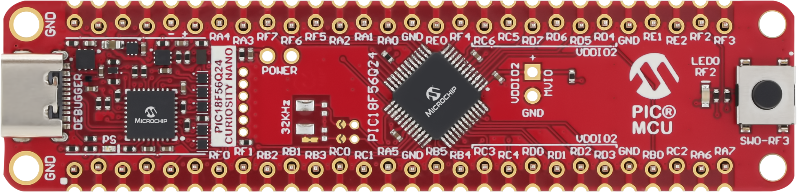
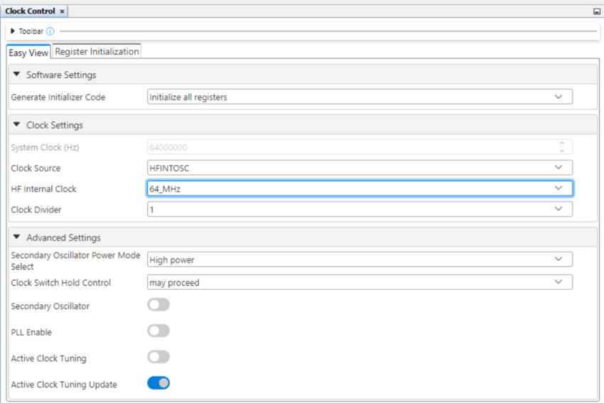
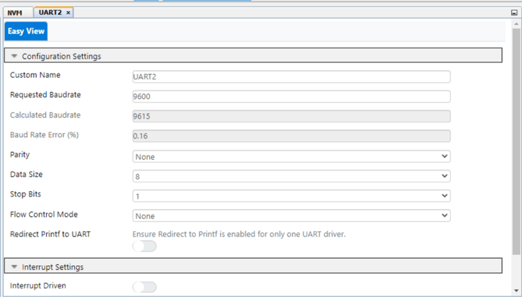
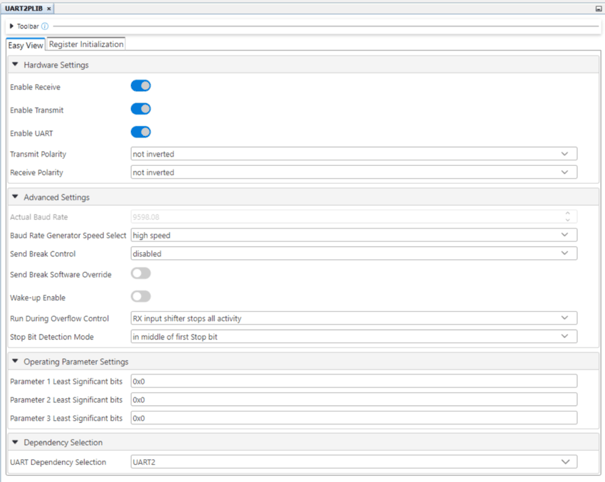
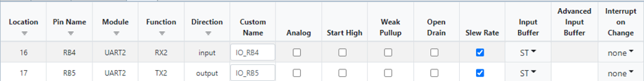
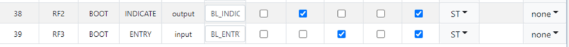
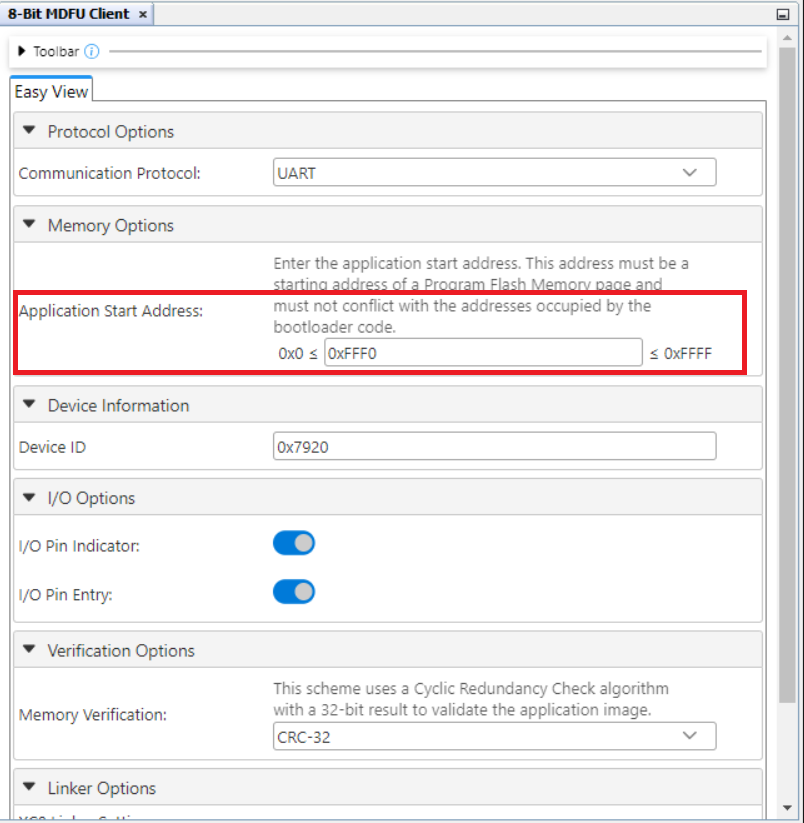
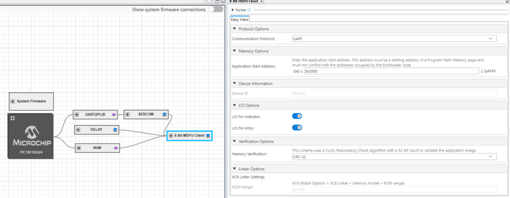

<!-- Please do not change this logo with link -->

# Getting Started With the 8-bit MDFU Client for PIC18F56Q24 using MPLAB&reg; X

This is an example on how to use the MPLAB Code Configurator (MCC) generated code for configuring several basic Microchip Device Firmware Update (MDFU) bootloader solutions for the PIC18F56Q24 Curiosity Nano Evaluation Board.

The Microchip Device Firmware Update (MDFU) is a device firmware update ecosystem that uses a device agnostic host application to update the application firmware. The application image that is loaded into the host follows a custom file format that includes the device and application-specific parameters needed to perform the update. This repository provides the basic starting point to configure and customize the MCC Melody 8-Bit MDFU Client library on the PIC18F56Q24 Curiosity Nano Base for Click boards™ and also provides instructions for running the examples.

This example will demonstrate:
- How to configure the 8-Bit MDFU Client library in MCC Melody for different verification schemes
- How to create a simple Blinky LED application
- How to use the [`pyfwimagebuilder`](https://pypi.org/project/pyfwimagebuilder/) command line interface to convert application hex file into the application image
- How to use the [`pymdfu`](https://pypi.org/project/pymdfu/) command line interface to update the application firmware
---
## Related Documentation

- [PIC18F56Q24 Family Product Page](https://www.microchip.com/en-us/product/PIC18F56Q24)
- [8-Bit MDFU Client v1.0.0 Release Notes](https://onlinedocs.microchip.com/v2/keyword-lookup?keyword=RELEASE_NOTES_8BIT_MDFU_CLIENT_LIBRARY&version=latest&redirect=true)
- [8-Bit MDFU Client v1.0.0 Getting Started Guide](https://onlinedocs.microchip.com/v2/keyword-lookup?keyword=8BIT_MDFU_CLIENT&version=latest&redirect=true)
- [8-Bit MDFU Client v1.0.0 API Documentation](https://onlinedocs.microchip.com/v2/keyword-lookup?keyword=8BIT_MDFU_CLIENT&version=latest&redirect=true)
- [8-Bit MDFU Client v1.0.0 Known Issues List](https://onlinedocs.microchip.com/v2/keyword-lookup?keyword=KNOWN_ISSUES_8BIT_MDFU_CLIENT&version=latest&redirect=true)

---
## Software Used

- [MPLAB X IDE 6.20.0](https://www.microchip.com/en-us/tools-resources/develop/mplab-x-ide)
- [MPLAB XC8 2.46.0](https://www.microchip.com/en-us/tools-resources/develop/mplab-xc-compilers)
- [MPLAB Code Configurator (MCC) 5.5.1](https://www.microchip.com/mplab/mplab-code-configurator)
- [MPLAB Code Configurator (MCC) Device Libraries PIC10 / PIC12 / PIC16 / PIC18 MCUs](https://www.microchip.com/en-us/tools-resources/develop/libraries/microchip-libraries-for-applications)
- [Python 3.8 or later](https://www.python.org/downloads/)
- [pyfwimagebuilder v1.0.1.14](https://pypi.org/project/pyfwimagebuilder/)
- [pymdfu v1.0.1.5](https://pypi.org/project/pymdfu/)

---
## Hardware Used

- PIC18F56Q24 Curiosity Nano [(EV01E86A)](https://www.microchip.com/en-us/development-tool/ev01e86a)

---
## Setup

MDFU Client and Application projects have to be configured according to [Client Setup](#client-setup) and [Application Setup](#application-setup). The following project setup is the same for all the example project pairs. If something goes wrong while running these examples, confirm that the settings in the respective projects are consistent with the options seen in the following sections.

### [Client Setup](#client-setup)

**Configuration Bits**
- External Oscillator Selection bits: Oscillator not enabled
- Reset Oscillator Selection bits: HFINTOSC with HFFRQ = 64 MHz and CDIV = 1:1 

**Clock Control**
- Clock Source: HFINTOSC
- HF Internal Clock: 8_MHz
- Clock Divider: 1

**NVM**
- Generate Flash APIs: Enabled
- Generate EEPROM APIs: Enabled
- Generate Device ID APIs: Enabled

**UART**
- Custom Name: UART2
- Requested Baudrate: 9600
- Parity: None
- Data Size: 8
- Stop Bits: 1
- Flow Control Mode: None
- Redirect Printf to UART: Disabled
- Interrupt Driven: Disabled

**UART PLIB**
- Actual Baud Rate: 9615.385
- Enable Receive: Enabled
- Receive/Transmit Polarity: Non-Inverted
- Enable UART: Enable
- Enable Transmit: Enabled

**UART Pins**
- UART TX: RB5
- UART RX: RB4

**8-Bit MDFU Client**
- Communication Protocol: UART
- Application Start Address: Different for each project based on the verification selected
- Device ID: 0x7920
- I/O Pin Indicator: Enabled
- I/O Pin Entry: Enabled
- Memory Verification: Assigned Based on Example Project Naming Convention

**Tip**: The easiest way to get the correct device ID is to connect your device and use the **Refresh Debug Tool Status** button on the Dashboard left panel in MPLAB X IDE. Upon clicking the button and selecting the correct PKOB Nano, in the Output window it prints out the device ID and other information.

*Example for CRC32 Verification*

**8-Bit MDFU Client I/O**
- BOOT INDICATE: RF2
- BOOT ENTRY: RF3

- BOOT INDICATE: Start High
- BOOT ENTRY: Weak Pullup

**Updating Application Start Address**

This is an important step to ensure that the bootloader and application FLASH sections are configured to provide maximum space for the application while decreasing the bootloader section to be as close to the memory consumed by the bootloader code as possible.

- At this point, as mentioned in the 8-Bit MDFU Client section, this depends on the verification method used in the project. Initially, configure the application start address to be closer to the MAXSIZE to allow sufficient memory for flashing the bootloader code. Do not exceed (MAXSIZE - 4)

- After a clean and build, the bytes of memory consumed by bootloader can be observed under the Memory Summary section in the Output window

- Update the application start address to the start address of the next page in FLASH, following the memory allocation utilized by the bootloader code

- Since in this example, the bootloader code consumes 0x168B bytes, the application start address can be configured to 0x2000 

- After updating the application start address, final configurations must be as mentioned below 

**8-Bit MDFU Client Project Properties**
- ROM Ranges: This option is configured based on the start address of the application
- For example, if the application starts at 0x2000 then this value will reflect as `0-1FFF`

---
### [Application Setup](#application-setup)

**I/O Pins**
- GPIO Output: RF2

- Custom Name: LED

**Project Properties**

Linker Additional Options
- Codeoffset: 0x<APP_START> = 0x2000
- Checksum: Dependant on the verification scheme

**Note**:*Check the table below to understand how the CRC32 option must be configured in the application projects*

|Verification Scheme | Checksum Setting |
|---- |---- |
|Reset Vector | N/A |
|Status Byte | N/A |
|Checksum | C00-3FFD@3FFE,width=-2,algorithm=2,code=3F |
|CRC-16 | C00-3FFD@3FFE,width=-2,algorithm=5,offset=FFFF,polynomial=1021,code=3F |
|CRC-32 | C00-3FFB@3FFC,width=-4,algorithm=-5,offset=FFFFFFFF,polynomial=04C11DB7,code=3F |

Fill Flash Memory
- Which area to fill: Provide Range to fill
- How to fill it: Constant or incremental value
- Sequence: 0xFFFF
- Increment/Decrement: No Incrementing
- Memory address range: 0x<APP_START>:0x<FLASH_END> = 0x2000:0xFFFF

## Operation
In this section, we will walkthrough how to run the examples in this repository. This example shows how to execute the CRC32 verification example and update the device Flash memory with the CRC32 application image to demonstrate a successful device firmware update (DFU).

**8-Bit MDFU Client Operation**

1. Open the MDFU Client Project.

2. Set MDFU Client Project as Main Project.

3. Right click, then select Clean and Build.

4. Program the MDFU Client Project

**Bootloader Operation After Initial Programming**

After the initial programming, the LED must be on.

**Application Operation**
1. Open the Application Project that is configured for your selected verification scheme.

2. Set the application project as the Main Project.

3. Build the required Application project.

Right click, then select Clean and Build

4. Build the Application Image File using **pyfwimagebuilder**.

*Hint: The configuration TOML file is generated by the MDFU Client project under \mcc_generated_files\bootloader\configurations*

**Example Command:**

`pyfwimagebuilder build -i "application_hex_file.hex"  -c "bootloader_configuration.toml" -o output.img`

5. Use the **pymdfu** host tool to transfer the application image file to the bootloader.

*Hint: You can find the COM port of the MCU using the MPLAB Data Visualizer.*

**Example Command:**

`pymdfu update serial ./crc32.img --baudrate 9600 --port COM##`

**Application Has Been Updated Successfully**

## Summary

This repository demonstrates how to configure the 8-Bit MDFU Client library in MCC to enable device firmware updates over UART on a PIC18F56Q24 Curiosity Nano.

## Contents

- [Back to Related Documentation](#related-documentation)
- [Back to Software Used](#software-used)
- [Back to Hardware Used](#hardware-used)
- [Back to Setup](#setup)
- [Back to Operation](#operation)
- [Back to Summary](#summary)
- [Back to Top](#getting-started-with-the-8-bit-mdfu-client-for-pic18f56q24-using-mplab®-x)
