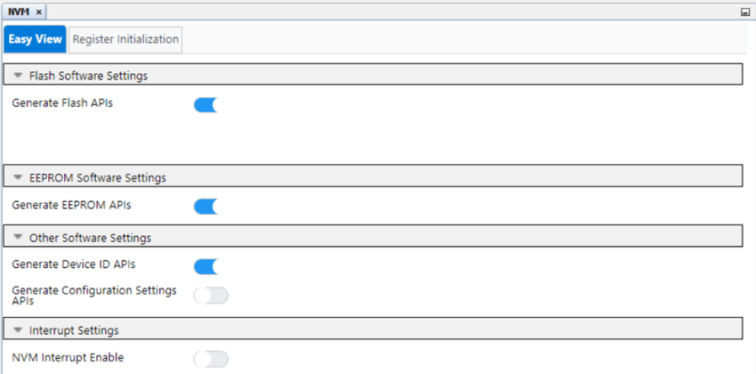
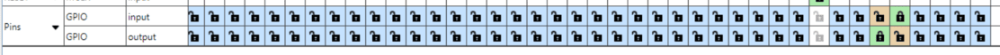
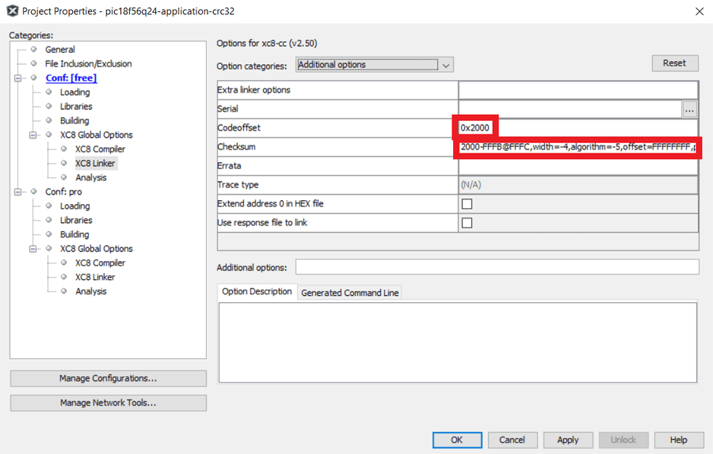
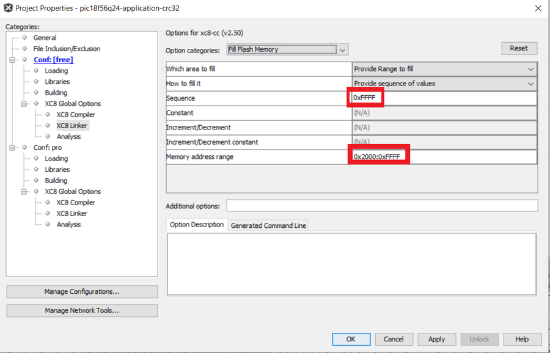
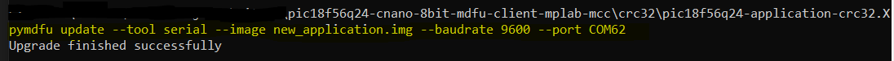
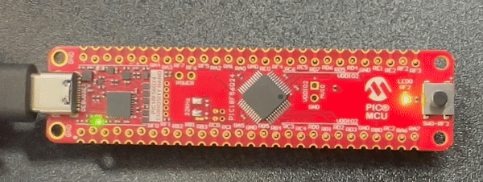

<!-- Please do not change this logo with link -->

# Getting Started With the 8-Bit MDFU Client for PIC18F56Q24 Using MPLAB&reg; X

This example demonstrates how to utilize MPLAB Code Configurator (MCC) generated code to set up various Microchip Device Firmware Update (MDFU) bootloader solutions for the PIC18F56Q24 Curiosity Nano Evaluation board.

The MDFU is a firmware update system that employs a device-independent host application to update application firmware. The application image loaded into the host adheres to a custom file format, incorporating device and application-specific parameters necessary for the update. This repository offers a foundational setup to configure and customize the MCC Melody 8-Bit MDFU Client library on the PIC18F56Q24 Curiosity Nano Evaluation board, along with instructions for executing the examples.

This example demonstrates:
- How to configure the 8-Bit MDFU Client library in MCC Melody for different verification schemes
- How to create a simple Blinky LED application
- How to use the [`pyfwimagebuilder`](https://pypi.org/project/pyfwimagebuilder/) command line interface to convert the application hex file into an application image
- How to use the [`pymdfu`](https://pypi.org/project/pymdfu/) command line interface to update the application firmware

## Related Documentation

- [PIC18F56Q24 Family Product Page](https://www.microchip.com/en-us/product/PIC18F56Q24)
- [8-Bit MDFU Client v1.1.0 Release Notes](https://onlinedocs.microchip.com/v2/keyword-lookup?keyword=RELEASE_NOTES_8BIT_MDFU_CLIENT_LIBRARY&version=latest&redirect=true)
- [Getting Started Document, API Reference and Update Image Specification](https://onlinedocs.microchip.com/v2/keyword-lookup?keyword=8BIT_MDFU_CLIENT&version=latest&redirect=true)
- [8-Bit MDFU Client Known Issues List](https://onlinedocs.microchip.com/v2/keyword-lookup?keyword=KNOWN_ISSUES_8BIT_MDFU_CLIENT&version=latest&redirect=true)

## Software Used

- [MPLAB X IDE 6.20.0](https://www.microchip.com/en-us/tools-resources/develop/mplab-x-ide)
- [MPLAB XC8 2.50.0](https://www.microchip.com/en-us/tools-resources/develop/mplab-xc-compilers)
- [MPLAB Code Configurator (MCC) 5.5.1](https://www.microchip.com/mplab/mplab-code-configurator)
- [MPLAB Code Configurator (MCC) Device Libraries PIC10/12/16/18 microcontrollers (MCUs)](https://www.microchip.com/en-us/tools-resources/develop/libraries/microchip-libraries-for-applications)
- [Python 3.8 or later](https://www.python.org/downloads/)
- [pyfwimagebuilder v1.0.1](https://pypi.org/project/pyfwimagebuilder/)
- [pymdfu v2.4.0](https://pypi.org/project/pymdfu/)

## Hardware Used

- PIC18F56Q24 Curiosity Nano [(EV01E86A)](https://www.microchip.com/en-us/development-tool/ev01e86a)

## Setup

The following project setup steps demonstrate the basic configuration for setting up the 8-Bit MDFU Client with Universal Asynchronous Receiver-Transmitter (UART) communication. The configuration bits, clock, Non-Volatile Memory (NVM), and General Purpose Input/Output (GPIO) settings will be consistent across all examples in this repository, and any deviations from this setup due to the chosen communication protocol will be described individually later in this section.

### [Client Setup](#client-setup)

**Configuration Bits**
- External Oscillator Selection bits: Oscillator not enabled
- Reset Oscillator Selection bits: HFINTOSC with HFFRQ = 64 MHz and CDIV = 1:1 

**Clock Control**
- Clock Source: HFINTOSC
- HF Internal Clock: 8_MHz or higher
- Clock Divider: 1

**NVM**
- Generate Flash APIs: Enabled
- Generate EEPROM APIs: Enabled
- Generate Device ID APIs: Enabled

**8-Bit MDFU Client**

This section will guide you through the setup process for UART communication. For more details on configuring and operating other communication protocols, refer to the pages listed below:
- [SPI Communication](spi/README.md)
- [I2C Communication](i2c/README.md)

**8-Bit MDFU Client with UART Communication**

- Communication Protocol: SERCOM
- Application Start Address: Different for each project based on the verification selected
- Device ID: 0x7920 (automatically added)
- I/O Pin Indicator: Enabled
- I/O Pin Entry: Enabled
- Memory Verification: Assigned based on the example project naming convention

> **Tip**: This example is for CRC32 verification.

**UART**
- Custom Name: SERCOM
- Requested Baudrate: 9600
- Parity: None
- Data Size: 8
- Stop Bits: 1
- Flow Control Mode: None
- Redirect Printf to UART: Disabled
- Interrupt Driven: Disabled

**UART PLIB**
- Actual Baud Rate: 9615.385
- Enable Receive: Enabled
- Receive/Transmit Polarity: Non-Inverted
- Enable UART: Enable
- Enable Transmit: Enabled

**UART Pins**
- UART TX: RB5
- UART RX: RB4

**8-Bit MDFU Client I/O**
- BOOT INDICATE: RF2
- BOOT ENTRY: RF3

- BOOT INDICATE: Start High
- BOOT ENTRY: Weak Pull-up

**8-Bit MDFU Client Project Properties**

> **Tip**: These values can be copied from the "Linker Options" section of 8-Bit MDFU Client MCC UI.

- ROM Ranges: This option is configured based on the application's start address
- For example, if the application starts at 0x2000 then this value will reflect as `0-1FFF`

---
### [Application Setup](#application-setup)

This section is consistent for any example created in this repository.

**Clock And Configuration**
- Set the clock and configuration bits to the same values that were set in the MDFU Client

**I/O Pins**
- GPIO Input: RF3
    - Custom Name: BTN
    - Weak Pull-up: Enabled
- GPIO Output: RF2
    - Custom Name: LED

**Project Properties**

Linker Additional Options
- Codeoffset: 0x<APP_START> = 0x2000
- Checksum: Dependant on the verification scheme

Check the table below to understand how the CRC32 option must be configured in the application projects:

|Verification Scheme | Checksum Setting |
|---- |---- |
|Reset Vector | N/A |
|Status Byte | N/A |
|Checksum | 2000-FFFD@FFFE,width=-2,algorithm=2 |
|CRC-16 | 2000-FFFD@FFFE,width=-2,algorithm=5,offset=FFFF,polynomial=1021 |
|CRC-32 | 2000-FFFB@FFFC,width=-4,algorithm=-5,offset=FFFFFFFF,polynomial=04C11DB7 |

Fill Flash Memory
- Which area to fill: Provide Range to fill
- How to fill it: Constant or incremental value
- Sequence: 0xFFFF
- Increment/Decrement: No Incrementing
- Memory address range: 0x<APP_START>:0x<FLASH_END> = 0x2000:0xFFFF

## Operation
This section explains how to run the examples in this repository. This example shows how to execute the CRC32 verification example and update the device Flash memory with the CRC32 application image to demonstrate a successful device firmware update (DFU).

**8-Bit MDFU Client Operation**

1. Open the MDFU Client Project.

2. Set MDFU Client Project as Main Project.

3. Right click, then select Clean and Build.

4. Program the MDFU Client Project.

**Bootloader Operation After Initial Programming**

After the initial programming, the LED must be on.

**Application Operation**
1. Open the Application Project that is configured for your selected verification scheme.

2. Set the application project as the Main Project.

3. Build the required Application project.

Right click, then select Clean and Build

4. Build the Application Image File using [pyfwimagebuilder](https://pypi.org/project/pyfwimagebuilder/).

- To build the application image files, navigate to the Projects tab and right click *Important Files>`build_free_image.bat`* for Windows or *Important Files>`build_free_image.sh`* for Mac and Linux
- Select Run

> **Tip**: The configuration TOML file is generated by the MDFU Client project under `\mcc_generated_files\bootloader\configurations`

**Example Command:**

`pyfwimagebuilder build -i "application_hex_file.hex"  -c "bootloader_configuration.toml" -o output.img`

5. Use the [pymdfu](https://pypi.org/project/pymdfu/) host tool to transfer the application image file to the bootloader.

> **Tip**: You can find the COM port of the MCU using the MPLAB&reg; Data Visualizer.

- To run the update with the examples, navigate to the project tab and right click, *Important Files>`pymdfu_update.bat`* for Windows or *Important Files>`pymdfu_update.sh`* for Mac and Linux. Double click to open the file.
- Edit the port number to the CDC port name that is assigned to the Curiosity Nano device
- Then right click on the script and select Run

**Example Command:**

`pymdfu update --tool serial --image ./crc32.img --baudrate 9600 --port COM##`

**Application Has Been Updated Successfully**

**Example Application Features:**

1. Blink the on-board LED at a rate of 200 ms.
2. Pressing the button on the Curiosity Nano and holding it down will force entry into the bootloader, allowing a new application to be transferred.

## Summary

This repository demonstrates how to configure the 8-Bit MDFU Client library in MCC to enable device firmware updates over UART on a PIC18F56Q24 Curiosity Nano.

## Contents

- [Back to Related Documentation](#related-documentation)
- [Back to Software Used](#software-used)
- [Back to Hardware Used](#hardware-used)
- [Back to Setup](#setup)
- [Back to Operation](#operation)
- [Back to Summary](#summary)
- [Back to Top](#getting-started-with-the-8-bit-mdfu-client-for-pic18f56q24-using-mplab-x)
