

# 8-Bit MDFU Client Setup for I2C Communication

[Go Back](../README.md)

## Required Hardware
- [Curiosity Nano Base for Click boards™](https://www.microchip.com/en-us/development-tool/AC164162)
- [MCP2221A Breakout Module](https://www.microchip.com/en-us/development-tool/ADM00559)
- Three female-to-male jumper wires

## Hardware Configuration
[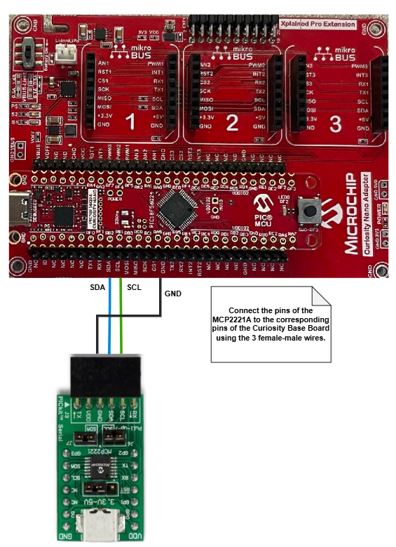](../images/i2c/HardwareSetup_I2C.png)

## 8-Bit MDFU Client I2C Communication

- Communication Protocol: I2C
- Application Start Address: 0x3000
- Device ID: 0x7920 (automatically added)
- I/O Pin Indicator: Enabled
- I/O Pin Entry: Enabled
- Memory Verification: CRC32

[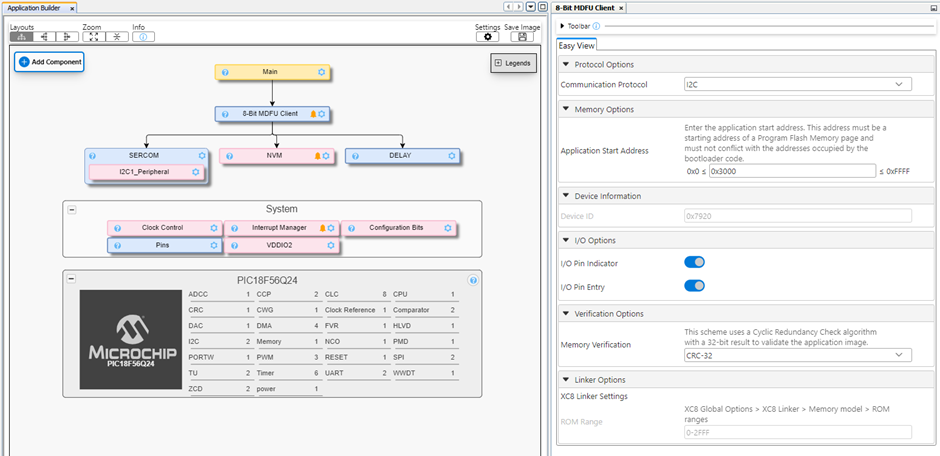](../images/i2c/MDFUClientSetup_I2C.png)

**I2C**
- Custom Name: SERCOM
- Client Address: 0x20
- Client Mask: 0x7F
- I2C Client PLIB Selector: I2C1

[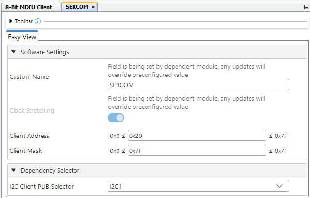](../images/i2c/I2CDriverSetup.png)

**I2C1 PLIB**
- Interrupt Driven: Enabled

[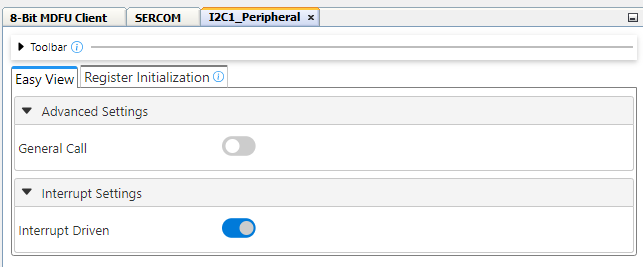](../images/i2c/I2CPLIBSetup.png)

**I2C Pins**
- I2C SCL: RB1
- I2C SDA: RB2

[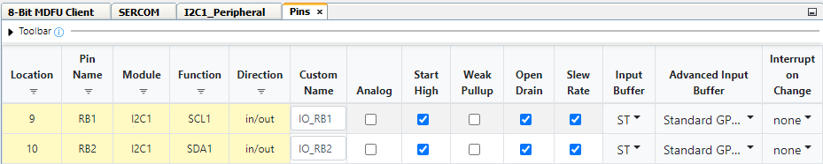](../images/i2c/I2CPortsSetup.png)

**8-Bit MDFU Client I/O**
- BOOT INDICATE: RF2
- BOOT ENTRY: RF3

[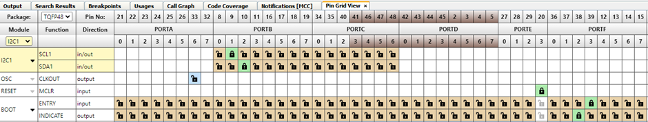](../images/i2c/IOPortSetup.png)

- BOOT INDICATE: Start High
- BOOT ENTRY: Weak Pullup

**8-Bit MDFU Client Project Properties**
- ROM Ranges: This option is configured based on the start address of the application. For example, if the application starts at 0x3000 then this value will reflect as `0-2FFF`.

[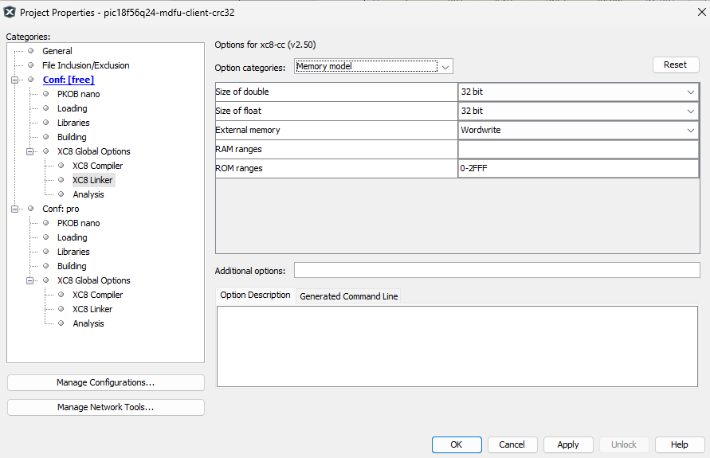](../images/i2c/ProjectProperties_I2C.png)

### Application Setup
Refer to the [Application Setup](../README.md#application-setup) section in the main Readme file.

## Operation
This example shows how to execute the CRC32 verification example and update the device Flash memory with the CRC32 application image to demonstrate a successful device firmware update (DFU) over the I2C communication protocol.

**8-Bit MDFU Client Operation**

1. Open the MDFU client project.

[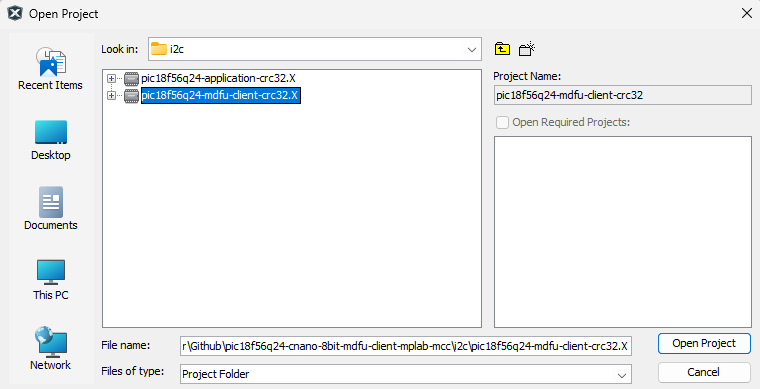](../images/i2c/openProjectMDFU_I2C.png)

2. Set the MDFU client project as Main Project.

[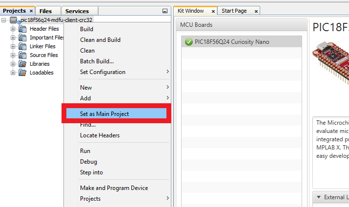](../images/setAsMainProject_SPI.PNG)

3. Right click, then select **Clean and Build**.

[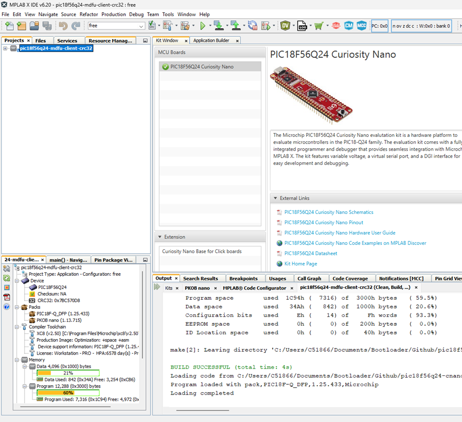](../images/i2c/CleanAndBuildMDFU.png)

4. Program the MDFU client project.

[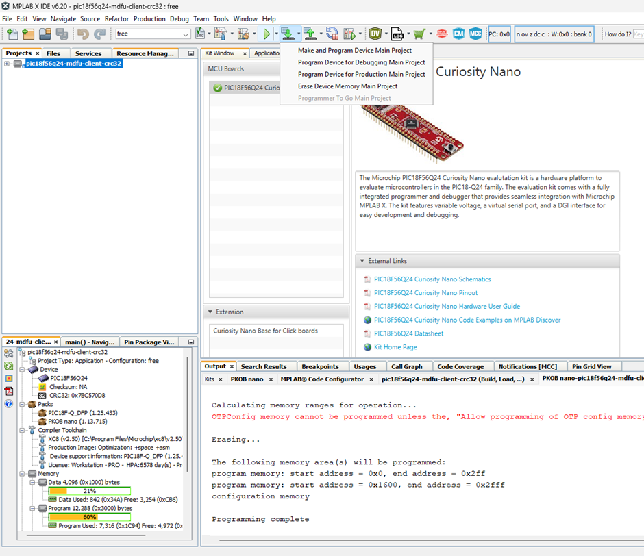](../images/i2c/ProgramMDFU.png)

**Bootloader Operation After Initial Programming**

After the initial programming, the LED must be ON.

[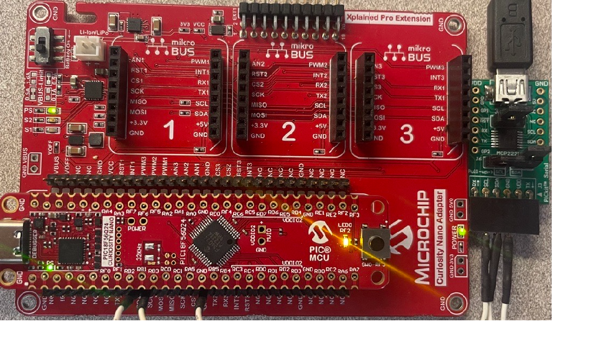](../images/i2c/PIC18F56Q24_BootMode.png)

**Application Operation**
1. Open the application project configured for your selected verification scheme.

[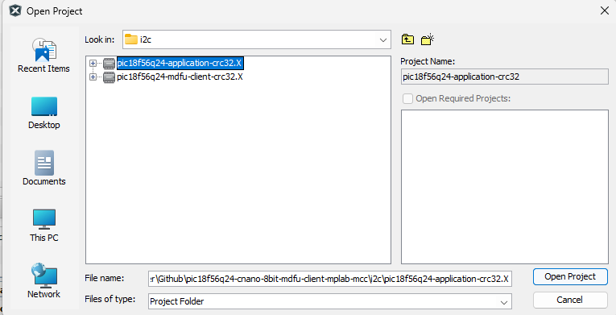](../images/i2c/openProjectApp.png)

2. Set the application project as the Main Project.

3. Build the application project. Right click, then select **Clean and Build**.

[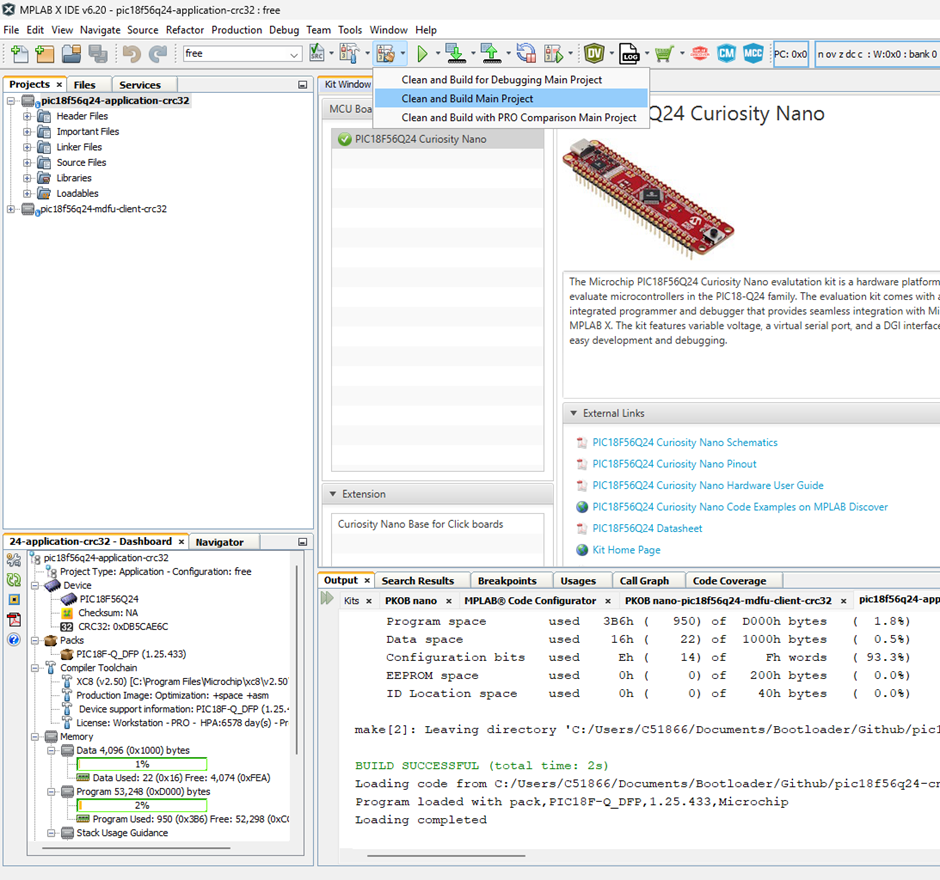](../images/i2c/CleanAndBuildApp.png)

4. Build the Application Image File using [pyfwimagebuilder](https://pypi.org/project/pyfwimagebuilder/):

- Navigate to the **Projects** tab and right click *Important Files>`build_free_image.bat`* for Windows or *Important Files>`build_free_image.sh`* for Mac and Linux.
- Select Run.

**Example Command:**

Below is an example of the command used in the previous step.

`pyfwimagebuilder build -i "application_hex_file.hex"  -c "mdfu_config_file.toml" -o output.img`

[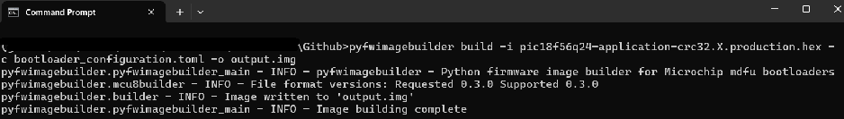](../images/i2c/BuildTheImage.png)

> **Tip**: The configuration TOML file is generated by the MDFU client project.

5. Use the [pymdfu](https://pypi.org/project/pymdfu/) host tool to transfer the application image file to the bootloader:

- Navigate to the **Projects** tab and right click, *Important Files>`pymdfu_update.bat`* for Windows or *Important Files>`pymdfu_update.sh`* for Mac and Linux. Double click to open the file.
- Then right click the script in the **Files** tab and select Run.

**Example Command:**

Below is an example of the command used in the previous step.

`pymdfu update --tool mcp2221a --image ./output.img --interface i2c --address 32 --clk-speed 100k`

**Application Has Been Updated Successfully**

[Back to top](#8-bit-mdfu-client-setup-for-i2c-communication)
