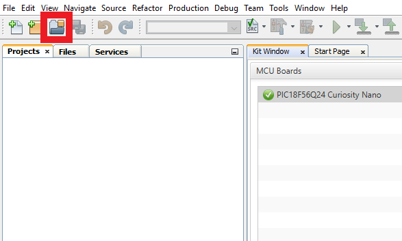

# 8-Bit MDFU Client Setup for SPI Communication

[Go Back](../README.md)

## Required Hardware
- [Curiosity Nano Base for Click boards™](https://www.microchip.com/en-us/development-tool/AC164162)
- [MCP2210 Breakout Module](https://www.microchip.com/en-us/development-tool/ADM00419)
-  Five female-to-female jumper wires

## Hardware Configuration

## 8-Bit MDFU Client SPI Communication

- Communication Protocol: SPI
- Application Start Address: 0x2000
- Device ID: 0x7920 (automatically added)
- I/O Pin Indicator: Enabled
- I/O Pin Entry: Enabled
- Memory Verification: CRC32

**SPI**
- Custom Name: SERCOM
- BOOT_CONFIG: Mode 0
- Interrupt Driven: Disabled

**MSSP1 PLIB**
- Serial Protocol: SPI
- Enable Client Select: Enabled

**SPI Pins**
- MSSP SCK: RC1
- MSSP SDI (MOSI): RB3
- MSSP SDO (MISO): RC0
- MSSP SS (Chip Select): RA5
    - Custom Name: CHIP_SELECT

**8-Bit MDFU Client I/O**
- BOOT INDICATE: RF2
- BOOT ENTRY: RF3

- BOOT INDICATE: Start High
- BOOT ENTRY: Weak Pullup

**8-Bit MDFU Client Project Properties**
- ROM Ranges: This option is configured based on the start address of the application
- For example, if the application starts at 0x2000 then this value will reflect as `0-1FFF`

### Application Setup
Refer to the [Application Setup](../README.md#application-setup) section in the main Readme file.

## Operation
This example shows how to execute the CRC32 verification example and update the device Flash memory with the CRC32 application image to demonstrate a successful device firmware update (DFU) over the SPI communication protocol.

**8-Bit MDFU Client Operation**

1. Open the MDFU client project.

2. Set MDFU client project as Main Project.

3. Right click, then select **Clean and Build**.

4. Program the MDFU client project.

**Bootloader Operation After Initial Programming**

After initial programming, the LED must be on.

**Application Operation**
1. Open the application project that is configured for your selected verification scheme.

2. Set the application project as the Main Project.

3. Build the required application project.

Right click, then select Clean and Build

4. Build the Application Image File using [pyfwimagebuilder](https://pypi.org/project/pyfwimagebuilder/).

- To build the application image files, navigate to the Projects tab and right click *Important Files>`build_free_image.bat`* for Windows or *Important Files>`build_free_image.sh`* for Mac and Linux
- Select Run

**Example Command:**

Below is an example of the command used in the above step.

`pyfwimagebuilder build -i "application_hex_file.hex"  -c "mdfu_config_file.toml" -o output.img`

> **Tip**: The configuration TOML file is generated by the MDFU Client project.

5. Use the [pymdfu](https://pypi.org/project/pymdfu/) host tool to transfer the application image file to the bootloader.

- To run the update with the examples, navigate to the project tab and right click, *Important Files>`pymdfu_update.bat`* for Windows or *Important Files>`pymdfu_update.sh`* for Mac and Linux. Double click to open the file.
- Edit the chip select number to the proper GPIO you have set on your MCP2210 Breakout Module
- Then right click on the script in the Files tab and select **Run**

**Example Command:**

Below is an example of the command used in the above step.

`pymdfu update --tool mcp2210 --image ./output.img --chip-select 7 --clk-speed 50000`

**Application Has Been Updated Successfully**

[Back to top](#8-bit-mdfu-client-setup-for-spi-communication)
